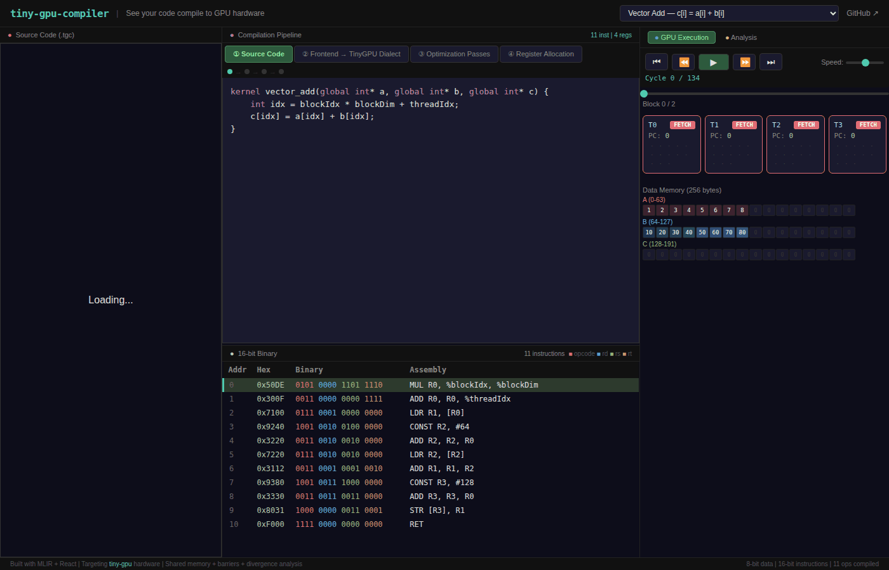

# tiny-gpu-compiler

**An MLIR-based compiler that takes GPU kernels and compiles them to real hardware instructions, step by step.**

Most engineers know GPUs run parallel code. Few understand exactly what happens between writing `c[i] = a[i] + b[i]` and the silicon executing it. This project makes that journey visible. Write a GPU kernel in a C-like language, watch it lower through intermediate representations, see 16-bit binary instructions get emitted, and then run those instructions on a cycle-accurate GPU simulator -- all in your browser.

Built on [MLIR](https://mlir.llvm.org/) (the compiler infrastructure behind TensorFlow, PyTorch, and CUDA), targeting [tiny-gpu](https://github.com/adam-maj/tiny-gpu)'s open-source Verilog hardware.

<p align="center">
  
</p>

<p align="center">
  <a href="https://gautam1858.github.io/tiny-gpu-compiler/">Live Demo</a> &middot;
  <a href="#quick-start">Quick Start</a> &middot;
  <a href="#the-compilation-pipeline">How It Works</a> &middot;
  <a href="#the-dsl">Language Reference</a> &middot;
  <a href="#advanced-features">Advanced Features</a>
</p>

---

## What's New

- **Shared Memory + `__syncthreads()`** -- Block-scoped fast scratchpad with barrier synchronization, just like CUDA
- **Optimization Passes** -- Constant folding, dead code elimination, strength reduction, common subexpression elimination
- **Warp Divergence Analysis** -- Detects and visualizes when threads take different paths at branches
- **Memory Coalescing Analysis** -- Shows whether memory accesses are coalesced, strided, or scattered
- **Performance Profiling** -- Compute/memory ratio, register pressure, estimated cycles, performance scores
- **Interactive Debugger** -- Click any thread to inspect all 16 registers, NZP flags, and PC in real-time
- **Shared Memory Visualization** -- Watch the 64-byte scratchpad update live during simulation
- **3 New ISA Instructions** -- `SLDR` (shared load), `SSTR` (shared store), `BAR` (barrier)

---

## Why This Exists

[tiny-gpu](https://github.com/adam-maj/tiny-gpu) teaches how GPU **hardware** works at the RTL level. [tinygrad](https://github.com/tinygrad/tinygrad) teaches how GPU **software frameworks** work. Neither covers the critical middle layer: **the compiler that bridges them**.

This is the missing piece. It shows the full compilation pipeline from high-level parallel code to machine instructions that execute on actual GPU hardware:

```
Source Code (.tgc)          MLIR IR (TinyGPU Dialect)           16-bit Binary

kernel vec_add(             tinygpu.func @vec_add() {           0: 0x50DE  MUL R0,
  global int* a,              %0 = tinygpu.block_id : i8                   %blockIdx,
  global int* b,              %1 = tinygpu.block_dim : i8                  %blockDim
  global int* c) {     -->    %2 = tinygpu.mul %0, %1 : i8 --> 1: 0x300F  ADD R0,
  int i = blockIdx *          %3 = tinygpu.thread_id : i8                  R0,
          blockDim            %4 = tinygpu.add %2, %3 : i8                 %threadIdx
          + threadIdx;        %5 = tinygpu.load %4 : i8        2: 0x7100  LDR R1, [R0]
  c[i] = a[i] + b[i];        ...                               ...
}                             tinygpu.ret                       7: 0xF000  RET
                            }
```

---

## Quick Start

### Interactive Visualizer (No Installation Required)

Open the **[live demo](https://gautam1858.github.io/tiny-gpu-compiler/)** in your browser. Select an example kernel, step through the compilation stages, and watch the GPU execute your code cycle by cycle.

### Command-Line Compiler

```bash
# Clone
git clone --recursive https://github.com/gautam1858/tiny-gpu-compiler
cd tiny-gpu-compiler

# Docker (recommended -- includes LLVM/MLIR pre-built)
docker build -t tgc .
docker run -v $(pwd)/examples:/workspace tgc --emit asm /workspace/vector_add.tgc

# Native build (requires LLVM/MLIR 18)
cmake -G Ninja -S . -B build \
  -DMLIR_DIR=/path/to/llvm-install/lib/cmake/mlir \
  -DLLVM_DIR=/path/to/llvm-install/lib/cmake/llvm
cmake --build build
./build/bin/tgc --emit asm examples/vector_add.tgc
```

Output:

```asm
; vector_add -- 11 instructions, 3 registers used
0x50DE  MUL R0, %blockIdx, %blockDim   ; idx = blockIdx * blockDim
0x300F  ADD R0, R0, %threadIdx          ; idx += threadIdx
0x7100  LDR R1, [R0]                    ; R1 = a[idx]
0x9240  CONST R2, #64                   ; R2 = base address of b
0x3220  ADD R2, R2, R0                  ; R2 = &b[idx]
0x7220  LDR R2, [R2]                    ; R2 = b[idx]
0x3112  ADD R1, R1, R2                  ; R1 = a[idx] + b[idx]
0x9280  CONST R2, #128                  ; R2 = base address of c
0x3220  ADD R2, R2, R0                  ; R2 = &c[idx]
0x8021  STR [R2], R1                    ; c[idx] = R1
0xF000  RET                             ; done
```

---

## The Compilation Pipeline

The compiler performs five distinct transformations, each visible in the interactive visualizer:

```
     .tgc Source Code
            |
            v
   +------------------+
   |  Lexer + Parser  |     Tokenizes source, builds an AST via
   +---------+--------+     recursive descent with precedence climbing
             |
             v
   +------------------+
   |     MLIRGen      |     Walks the AST, emits TinyGPU dialect
   +---------+--------+     operations (all values are i8)
             |
             v
   +------------------+
   | Optimization     |     Constant folding, strength reduction,
   +---------+--------+     CSE, dead code elimination
             |
             v
   +------------------+
   |  Register Alloc  |     Linear scan over 13 general-purpose
   +---------+--------+     registers (R0-R12). R13/R14/R15 are
             |               reserved for blockIdx/blockDim/threadIdx
             v
   +------------------+
   |  Binary Emitter  |     Encodes each MLIR op into a 16-bit
   +---------+--------+     instruction word matching tiny-gpu's ISA
             |
             v
       16-bit Binary
       (runs on tiny-gpu
        Verilog hardware)
```

### Stage 1: Source Code

A C-like DSL designed for readability. Built-in variables `threadIdx`, `blockIdx`, and `blockDim` map directly to hardware registers.

```c
kernel vector_add(global int* a, global int* b, global int* c) {
    int idx = blockIdx * blockDim + threadIdx;
    c[idx] = a[idx] + b[idx];
}
```

### Stage 2: MLIR Intermediate Representation

The frontend emits operations in the `tinygpu` dialect. Every value is `i8` (8-bit unsigned), matching the hardware's data path. Pointer parameters are mapped to fixed 64-byte regions in data memory (a: 0-63, b: 64-127, c: 128-191).

### Stage 3: Optimization Passes

Four optimization passes run iteratively until convergence:

| Pass | What It Does | Example |
|------|-------------|---------|
| **Constant Folding** | Evaluates compile-time known expressions | `const 3 + const 5` → `const 8` |
| **Strength Reduction** | Replaces expensive ops with cheaper ones | `mul x, 2` → `add x, x`; `mul x, 0` → `const 0` |
| **CSE** | Deduplicates identical computations | Two identical `const 64` → reuse one |
| **Dead Code Elimination** | Removes ops whose results are never used | Unused temporaries deleted |

### Stage 4: Register Allocation

A linear scan allocator assigns physical registers. The IR is annotated with `{rd=N, rs=M, rt=K}` attributes showing which hardware registers each operation uses.

### Stage 5: Binary Emission + Execution

Each instruction is encoded into a 16-bit word. The binary view color-codes each field: opcode (red), destination register (blue), source registers (green, orange). The GPU simulator then executes these instructions across parallel threads.

---

## The DSL

A minimal language for expressing GPU kernels, now with shared memory support:

```c
kernel shared_reduce(global int* input, global int* output) {
    shared int scratch[4];                    // 4-byte shared memory array
    int idx = blockIdx * blockDim + threadIdx;

    scratch[threadIdx] = input[idx];          // Load into shared memory
    __syncthreads();                          // Barrier: wait for all threads

    if (threadIdx < 2) {
        scratch[threadIdx] = scratch[threadIdx] + scratch[threadIdx + 2];
    }
    __syncthreads();

    if (threadIdx < 1) {
        scratch[0] = scratch[0] + scratch[1];
        output[blockIdx] = scratch[0];        // Write reduction result
    }
}
```

| Feature | Details |
|---------|---------|
| **Types** | `int` (8-bit unsigned, matching hardware), `global int*` (pointer to data memory) |
| **Built-ins** | `threadIdx`, `blockIdx`, `blockDim` -- map to hardware registers R15, R13, R14 |
| **Arithmetic** | `+`, `-`, `*`, `/` |
| **Comparisons** | `==`, `!=`, `<`, `>`, `<=`, `>=` |
| **Control flow** | `for` loops, `if`/`else` |
| **Memory** | Array indexing with `[]` on pointer parameters |
| **Shared memory** | `shared int name[size]` -- fast block-scoped scratchpad |
| **Synchronization** | `__syncthreads()` -- barrier across all threads in a block |

### Memory Layout

| Memory Type | Size | Latency | Scope |
|-------------|------|---------|-------|
| **Global** (data memory) | 256 bytes | High (~4 cycles) | All blocks |
| **Shared** (scratchpad) | 64 bytes per block | Low (~1 cycle) | Single block |

Pointer parameters map to contiguous 64-byte regions:

| Parameter | Memory Region |
|-----------|--------------|
| 1st `global int*` | Addresses 0-63 |
| 2nd `global int*` | Addresses 64-127 |
| 3rd `global int*` | Addresses 128-191 |
| Scalar `int` parameters | Addresses 192+ |

---

## Advanced Features

### Warp Divergence Analysis

The compiler and simulator track when threads take different execution paths at branches. In the web UI, divergent threads are highlighted in red with a "DIV" badge, and the simulator shows a "DIVERGENT" indicator when threads are out of sync.

This teaches one of the most important GPU performance concepts: **thread divergence wastes SIMD lanes**.

### Memory Coalescing Analysis

Memory access patterns are analyzed statically:
- **Coalesced**: Sequential thread access (ideal, 1 transaction per warp)
- **Strided**: Non-unit stride access (suboptimal, multiple transactions)
- **Scattered**: Random access (worst case)

The Analysis panel shows each memory instruction's access pattern and estimated transaction count.

### Performance Profiling

The Analysis panel provides:
- **Performance Score** (0-100): Composite of memory efficiency, branch uniformity, and register pressure
- **Compute/Memory Ratio**: Whether the kernel is compute-bound or memory-bound
- **Register Pressure**: How many of 13 GPRs are used
- **Estimated Cycles**: Pipeline-aware cycle estimate

### Interactive Thread Debugger

Click any thread in the simulator to open a detailed register view showing:
- All 16 registers (R0-R15) with live values
- NZP condition flags (Negative/Zero/Positive)
- Current PC and instruction
- Special register labels (BID, BDM, TID)

---

## Target Hardware

The compiler emits binary for [tiny-gpu](https://github.com/adam-maj/tiny-gpu)'s 16-bit instruction set architecture:

### ISA Encoding

Each instruction is 16 bits wide, divided into four 4-bit fields:

```
  15  14  13  12  11  10   9   8   7   6   5   4   3   2   1   0
 +---+---+---+---+---+---+---+---+---+---+---+---+---+---+---+---+
 |   opcode      |     rd/nzp    |      rs       |      rt       |
 +---+---+---+---+---+---+---+---+---+---+---+---+---+---+---+---+
```

### Instruction Set

| Opcode | Mnemonic | Encoding | Operation |
|--------|----------|----------|-----------|
| `0000` | NOP | `0000 ---- ---- ----` | No operation |
| `0001` | BRnzp | `0001 nzp- target--` | Branch if (flags & nzp) != 0 |
| `0010` | CMP | `0010 ---- rs-- rt--` | Set NZP flags from rs - rt |
| `0011` | ADD | `0011 rd-- rs-- rt--` | rd = rs + rt |
| `0100` | SUB | `0100 rd-- rs-- rt--` | rd = rs - rt |
| `0101` | MUL | `0101 rd-- rs-- rt--` | rd = rs * rt |
| `0110` | DIV | `0110 rd-- rs-- rt--` | rd = rs / rt |
| `0111` | LDR | `0111 rd-- rs-- ----` | rd = mem[rs] |
| `1000` | STR | `1000 ---- rs-- rt--` | mem[rs] = rt |
| `1001` | CONST | `1001 rd-- imm-----` | rd = 8-bit immediate |
| `1010` | SLDR | `1010 rd-- rs-- ----` | rd = shared_mem[rs] |
| `1011` | SSTR | `1011 ---- rs-- rt--` | shared_mem[rs] = rt |
| `1100` | BAR | `1100 ---- ---- ----` | Thread barrier (syncthreads) |
| `1111` | RET | `1111 ---- ---- ----` | Thread done |

### Register File

| Register | Purpose |
|----------|---------|
| R0-R12 | General purpose (13 registers, managed by linear scan allocator) |
| R13 | `%blockIdx` -- current block index (read-only) |
| R14 | `%blockDim` -- threads per block (read-only) |
| R15 | `%threadIdx` -- thread index within block (read-only) |

### Hardware Specifications

| Parameter | Value |
|-----------|-------|
| Data width | 8 bits |
| Instruction width | 16 bits |
| Data memory | 256 bytes |
| Shared memory | 64 bytes per block |
| Program memory | 256 entries |
| Execution model | SIMD lockstep within blocks, sequential block dispatch |

---

## TinyGPU MLIR Dialect

The compiler defines a custom MLIR dialect with 18 operations, each mapping directly to hardware capabilities:

| Operation | Signature | Hardware Mapping |
|-----------|-----------|------------------|
| `tinygpu.func` | `@name() { ... }` | Kernel entry point |
| `tinygpu.thread_id` | `-> i8` | R15 read |
| `tinygpu.block_id` | `-> i8` | R13 read |
| `tinygpu.block_dim` | `-> i8` | R14 read |
| `tinygpu.add` | `i8, i8 -> i8` | ADD opcode |
| `tinygpu.sub` | `i8, i8 -> i8` | SUB opcode |
| `tinygpu.mul` | `i8, i8 -> i8` | MUL opcode |
| `tinygpu.div` | `i8, i8 -> i8` | DIV opcode |
| `tinygpu.load` | `i8 -> i8` | LDR opcode |
| `tinygpu.store` | `i8, i8 -> ()` | STR opcode |
| `tinygpu.shared_load` | `i8 -> i8` | SLDR opcode |
| `tinygpu.shared_store` | `i8, i8 -> ()` | SSTR opcode |
| `tinygpu.barrier` | `-> ()` | BAR opcode |
| `tinygpu.const` | `attr -> i8` | CONST opcode |
| `tinygpu.cmp` | `i8, i8 -> i8` | CMP opcode (sets NZP flags) |
| `tinygpu.branch` | `i8, attr, successor` | BRnzp opcode |
| `tinygpu.jump` | `successor` | BRnzp with mask=0b111 |
| `tinygpu.ret` | `-> ()` | RET opcode |

The dialect is defined in [TableGen ODS](include/tiny-gpu-compiler/Dialect/TinyGPU/TinyGPUOps.td), the standard MLIR approach for declarative operation specification.

---

## Output Formats

```bash
# MLIR intermediate representation (TinyGPU dialect)
tgc --emit mlir examples/vector_add.tgc

# Annotated assembly with hex encoding
tgc --emit asm examples/vector_add.tgc

# Raw hex (loadable into tiny-gpu Verilog testbench)
tgc --emit hex examples/vector_add.tgc

# Raw binary
tgc --emit bin examples/vector_add.tgc

# JSON trace (consumed by the web visualizer)
tgc --emit trace examples/vector_add.tgc
```

---

## Examples

| Kernel | Description | Instructions | Key Concepts |
|--------|-------------|-------------|--------------|
| [`vector_add.tgc`](examples/vector_add.tgc) | `c[i] = a[i] + b[i]` | 11 | Basic parallel kernel, memory addressing |
| [`shared_tile_add.tgc`](examples/shared_tile_add.tgc) | Tiled add with shared memory | ~15 | **Shared memory**, `__syncthreads`, tiling pattern |
| [`shared_reduce.tgc`](examples/shared_reduce.tgc) | Parallel tree reduction | ~18 | **Shared memory**, multiple barriers, thread masking |
| [`dot_product.tgc`](examples/dot_product.tgc) | `c[i] = a[i] * b[i]` | 11 | Per-element multiply for reduction |
| [`saxpy.tgc`](examples/saxpy.tgc) | `y[i] = a * x[i] + y[i]` | 14 | BLAS Level 1, scalar parameter loading |
| [`relu.tgc`](examples/relu.tgc) | `max(0, input[i])` | 15 | Conditional branching (if/else), **divergence** |
| [`vector_max.tgc`](examples/vector_max.tgc) | `max(a[i], b[i])` | 16 | Element-wise comparison, **divergent branches** |
| [`conv1d.tgc`](examples/conv1d.tgc) | 1D convolution with sliding kernel | 22 | For-loops, accumulation, register reuse |
| [`matrix_multiply.tgc`](examples/matrix_multiply.tgc) | Full matrix multiply with loop | 28 | For-loops, multi-register allocation |

---

## Project Structure

```
tiny-gpu-compiler/
  include/tiny-gpu-compiler/
    Dialect/TinyGPU/
      TinyGPUDialect.td          # Dialect definition (TableGen)
      TinyGPUOps.td              # 18 operations (TableGen ODS)
      TinyGPUDialect.h           # Generated dialect interface
      TinyGPUOps.h               # Generated operation interfaces
    Frontend/
      Lexer.h                    # Token types and lexer interface
      Parser.h                   # Recursive descent parser
      AST.h                      # Abstract syntax tree nodes
      MLIRGen.h                  # AST to MLIR conversion
    CodeGen/
      RegisterAllocator.h        # Linear scan register allocator
      TinyGPUEmitter.h           # Binary emission, trace output, analysis
    Passes/
      Passes.h                   # Optimization passes interface
    Pipeline/
      Pipeline.h                 # End-to-end compilation orchestration
  lib/
    Dialect/TinyGPU/             # Dialect and operation implementations
    Frontend/                    # Lexer, parser, MLIR generation
    CodeGen/                     # Register allocation, binary emission
    Passes/                      # Constant folding, DCE, CSE, strength reduction
    Pipeline/                    # Pipeline driver with analysis
  tools/tgc/
    tgc.cpp                      # Command-line compiler driver
  web/
    src/
      compiler/TGCCompiler.ts    # In-browser compiler (TypeScript)
      compiler/types.ts          # Shared types (instructions, analysis, simulation)
      simulator/TinyGPUSim.ts    # Cycle-accurate GPU simulator with shared mem
      components/
        Editor.tsx               # Monaco editor with .tgc highlighting
        PipelineView.tsx         # Compilation stage viewer (5 stages)
        BinaryView.tsx           # Color-coded binary instruction view
        GPUSimulator.tsx         # Interactive GPU execution + debugger
        AnalysisPanel.tsx        # Divergence, coalescing, performance profiling
      examples/index.ts          # Pre-loaded example kernels
  examples/                      # .tgc source files (including shared memory examples)
  test/                          # LLVM lit tests
  Dockerfile                     # Reproducible build with LLVM/MLIR
```

---

## Building from Source

### Prerequisites

- CMake 3.20+
- C++17 compiler (Clang or GCC)
- Ninja (recommended)
- LLVM/MLIR 18

### Option 1: Docker (Recommended)

The Dockerfile builds LLVM/MLIR from source and compiles the project in a single reproducible step:

```bash
docker build -t tgc .
docker run tgc --emit asm /workspace/vector_add.tgc
```

### Option 2: Build LLVM/MLIR Locally

```bash
git clone --depth 1 --branch llvmorg-18.1.8 https://github.com/llvm/llvm-project.git
cmake -G Ninja -S llvm-project/llvm -B llvm-build \
  -DCMAKE_BUILD_TYPE=Release \
  -DLLVM_ENABLE_PROJECTS=mlir \
  -DLLVM_TARGETS_TO_BUILD="host" \
  -DCMAKE_INSTALL_PREFIX=$HOME/llvm-install
cmake --build llvm-build --target install
```

Then build tiny-gpu-compiler:

```bash
cmake -G Ninja -S . -B build \
  -DCMAKE_BUILD_TYPE=Release \
  -DMLIR_DIR=$HOME/llvm-install/lib/cmake/mlir \
  -DLLVM_DIR=$HOME/llvm-install/lib/cmake/llvm
cmake --build build
```

### Running Tests

```bash
cmake --build build --target check-tgc
```

### Web Visualizer (Development)

```bash
cd web
npm install
npm run dev
```

---

## Roadmap

- [x] TinyGPU MLIR dialect (18 operations defined in TableGen)
- [x] Frontend compiler (lexer, parser, AST, MLIR generation)
- [x] Register allocator (linear scan, 13 GPRs)
- [x] Binary emitter (16-bit ISA encoding, 14 instructions)
- [x] Interactive web visualizer with in-browser compiler and GPU simulator
- [x] Shared memory + `__syncthreads()` barrier synchronization
- [x] Optimization passes (constant folding, DCE, strength reduction, CSE)
- [x] Warp divergence analysis and visualization
- [x] Memory coalescing analysis
- [x] Performance profiling (compute/memory ratio, register pressure, cycle estimation)
- [x] Interactive thread debugger (per-thread register inspection)
- [ ] CIRCT backend (generate custom accelerator Verilog via `tinygpu` -> `hw` + `comb` + `seq` lowering)
- [ ] WASM compilation (run the C++ MLIR compiler entirely in the browser via Emscripten)
- [ ] Hardware architecture overlay (show datapath schematic alongside execution)
- [ ] Tiled matrix multiply with shared memory (automated tiling pass)

---

## How It Relates to Real GPU Compilers

This project implements a simplified version of what production GPU compilers do:

| Concept | tiny-gpu-compiler | Production (e.g., NVIDIA CUDA) |
|---------|-------------------|-------------------------------|
| **IR Framework** | MLIR (TinyGPU dialect) | LLVM IR / NVVM / PTX |
| **Register Allocation** | Linear scan, 13 registers | Graph coloring, thousands of registers |
| **Memory Model** | Global (256B) + Shared (64B) | Global/shared/local/constant memory hierarchy |
| **Synchronization** | `__syncthreads()` barrier | `__syncthreads()`, `__syncwarp()`, atomics |
| **Optimization** | Constant fold, DCE, CSE, strength reduction | Hundreds of passes, loop tiling, vectorization |
| **Instruction Width** | 16-bit fixed | 64-bit+ variable-length |
| **Thread Model** | Lockstep SIMD within blocks | Warps of 32 threads, independent scheduling |
| **Data Width** | 8-bit unsigned | 32/64-bit float and integer |
| **Analysis** | Divergence + coalescing analysis | Full occupancy calculator, memory throughput |

The fundamental compilation stages are the same. The simplifications make each stage understandable without losing the essential structure.

---

## Acknowledgments

- [tiny-gpu](https://github.com/adam-maj/tiny-gpu) by Adam Majmudar -- the Verilog hardware that this compiler targets
- [MLIR](https://mlir.llvm.org/) / [LLVM Project](https://llvm.org/) -- the compiler infrastructure foundation
- [CIRCT](https://github.com/llvm/circt) -- hardware compiler framework (planned for future phase)

## License

Apache 2.0 with LLVM Exceptions. See [LICENSE](LICENSE).
